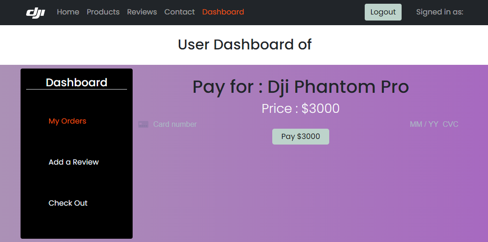
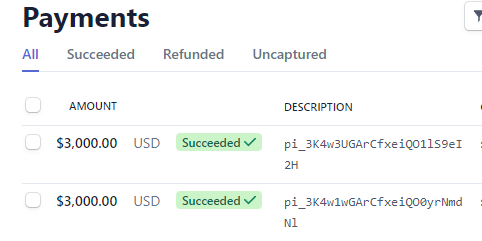
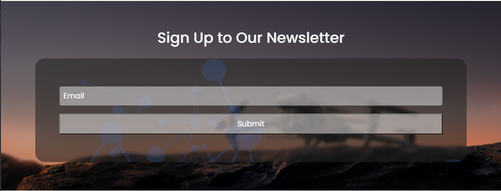
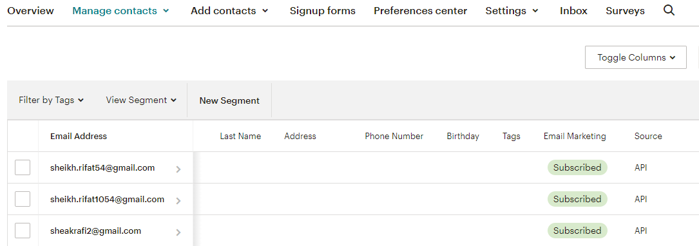

# Live link : https://dji-a-12.web.app/

# Server side Link : https://enigmatic-taiga-27234.herokuapp.com/

# Niche product website with admin access

- Drone related niche website
- Homepage has header,products,banner, reviews, Footer and one extra section
- User can see details and confirm purchase by clicking view details button of the products
- Email is automatically added if a user confirms an order of a product
- Implemented login system with email and password registration
- If logged in, user can see hise/her orders, give a review, checkout, or cancel his order in user dashboard
- If admin logs in, admin can see all orders, give admin permission to a user, add a product, or cancel order in admin dashboard
- Server side code : https://github.com/Sheikh-Rifat/mern-full-crud-website-server-side-node-mongo-express-12
- admin password : 123456

## Updated with Email marketing platform & payment gateway with stripe

- Payment page
- User can input his card number, and other related details
- after completing payment , in order page - payment option will show paid
- And this will be saved in the backend and will be updated in stripe
- Demo Card Number : 378282246310005 CVC : any 4 digits Date : any future date Zip : any
  

### Mailchimp

- After a user subscribes for newsletter, his/her email credential will be integrated with mailchimp contacts.
  

## Bonus

- Responsive
- Status approve system
- Delete a product
- See every users order
- Used .env file in both server side and client side
- Add a product
- separte admin and user dashboard

## Used things

- React router
- Toastify
- React slick
- React rating stars component
- Sweet Alert 2
- Hash Link
- React Bootstrap
- React Hook Form
- env

## Backend

- Node.js
- Express
- Mongo
- Cors
- Dot env
